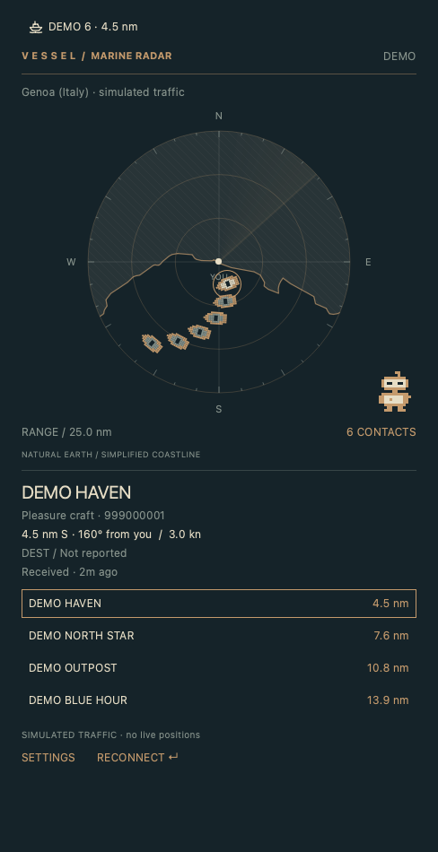
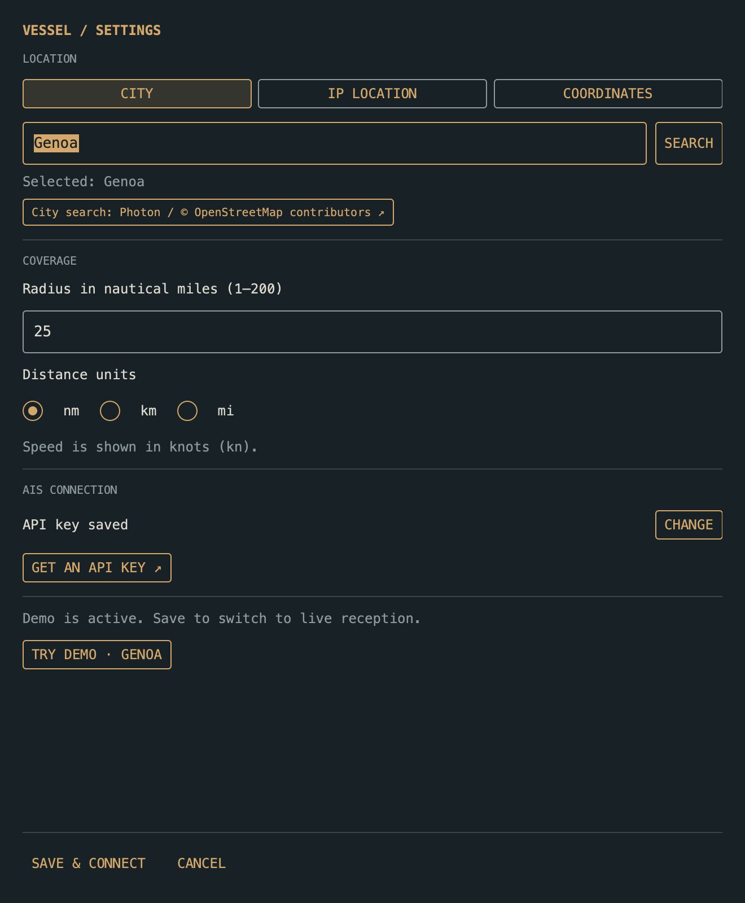
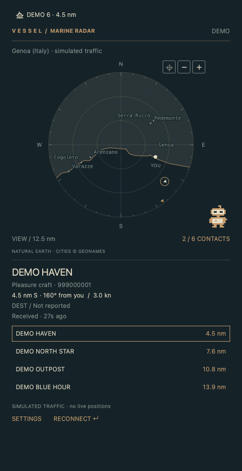

# Vessel

Released under the [MIT License](LICENSE).

**A little robot. A wide horizon.**

A theme-aware marine radar for Omarchy. See vessels around your location: sailing boats, fishing boats, ferries, cargo ships, tugs and other AIS-equipped traffic.

Vessel uses the active Omarchy palette, with a pixel-art lookout inspired by Outpost. North stays at the top; distance rings surround your position. Select a vessel on the radar or in the distance-sorted list to see its details.



*Qt-rendered demo with an example Outpost-like palette; Omarchy supplies your active theme and panel frame.*

## Features

- Map zoom controls: 1×, 2×, 4× and 8× without reconnecting the AIS stream.
- Offline coastal city labels with collision avoidance and theme-aware text.
- Gentle radar sweep: one revolution every 12 seconds, paused when the radar is hidden.
- City-name search with selectable results, plus optional manual coordinates.
- Compact boat icon in the bar and small directional markers on the radar.
- Offline land and coastline layer, projected around your position and colored by your theme.
- One AISStream connection shared across bar widgets on multiple monitors.
- Approximate IP geolocation, or a fixed latitude/longitude of your choice.
- Configurable 1–200 nautical mile radius; distances displayed in nm or km.
- Vessel name, category, bearing from you, speed, reported destination and signal age.
- Class A and Class B position reports, with static vessel information merged as it arrives.
- Positions older than five minutes fade; contacts disappear after 30 minutes.
- Automatic reconnection with backoff. No invented movement between live reports.
- Offline demo with clearly labelled simulated vessels; no account required.

AIS coverage is incomplete: boats without AIS and reports not received by AISStream won't appear. Empty results mean no contacts received, not an empty sea. Destination is reported by the vessel and may be missing or outdated. This is a desktop observation tool, not a navigation instrument.

### Radar markers

Vessels with a reported course use a small, oriented triangle (8 px). A dot (6 px)
means the course is unknown. The selected contact has a thin ring and a brighter
symbol; old positions remain dimmed. A generous invisible click area selects the
nearest contact when targets overlap. The distance-sorted list remains available
for contacts at exactly the same position. Pixel art is reserved for the lookout.

## Stylized map

The radar includes a local **Natural Earth** basemap: lightly hatched land, a fine coastline and clear water, all using the current Omarchy palette. It follows the configured location and range, with the same projection as the vessel markers. The Genoa (Italy) demo keeps simulated boats on the sea side of the coast.

Map geometry is bundled with the plugin, requires no API key and works offline. Python prepares the nearby geography once per receiver start; QML retains it while live vessel snapshots continue. If the data file is unavailable, the radar still works and displays **BASEMAP UNAVAILABLE**.

Natural Earth's 1:10 million data is intentionally generalized. Docks, narrow channels, small islands and inland waters may be absent; this is a geographic backdrop, not a navigation chart. Dataset provenance and rebuild instructions are in [data/README.md](data/README.md). Natural Earth data is public domain; the application code remains MIT.

[View the light-theme demo](docs/demo-preview-light.png).

Use **+** to zoom in and **−** to return toward the configured coverage radius.
Zoom changes only the view: it scales land, coastline, cities and vessel positions
together without changing the AIS subscription. **VIEW** shows the visible radius;
the contact counter shows displayed contacts versus all received contacts in range.
Contacts outside the view are hidden rather than moved onto the edge. The contact
list continues to cover the full configured range.

[See the zoomed-in radar](docs/zoom-preview.png).

City names come from a bundled, approximately 400 KB GeoNames extract and work
offline. The renderer prefers larger settlements and avoids overlapping names,
vessels and the centre marker. Zoom in to reveal names that would otherwise crowd
the chart. This is a selection of settlements near the generalized coastline,
not an exhaustive list of every harbour or village. City data is licensed under
[CC BY 4.0 by GeoNames](https://www.geonames.org/about.html); source, filtering and
rebuild instructions are in [data/README.md](data/README.md).


## Install

On Omarchy 4 with plugin support:

```sh
omarchy plugin add https://github.com/simoz/omarchy-vessel.git --enable
```

Accept Omarchy's plugin trust prompt, then click the **boat icon** widget.
On a fresh installation it opens **Settings**. No manual `pip install`, gem installation, compiler, or Hyprland configuration is needed.

**Requirements:** Omarchy's Quickshell shell (`qs.Commons` / `qs.Ui`, `quattro`
API) and Python 3.11+ with `venv`, OpenSSL and Zlib (provided by Omarchy's Python package).
At the first live start, Vessel creates a private virtual environment and installs
one dependency: `websockets` 17.1. **INSTALLING** shows progress; the receiver then
starts automatically. Internet access is needed for that first preparation.

The exact portable wheel and its SHA-256 hash are pinned in `requirements.txt`.
No compilation, system-wide package installation or `sudo` is used. The environment
lives under `~/.local/share/omarchy-vessel/python/` (or `$XDG_DATA_HOME`) and is reused
on later starts. A Python or dependency version change creates a fresh environment.
The plugin folder stays free of installed dependencies and virtualenv symlinks.

Settings and the Genoa (Italy) demo use only the standard library and work before the
live dependency is installed. If setup fails, check the network and available
disk space, then click **RECONNECT** to retry.

### Configure from the widget

1. Open **Settings** from the Vessel panel.
2. Paste your AISStream API key into the masked field.
3. Use approximate IP location, or disable it and type a city name. Click **SEARCH**, then select a result. **Enter coordinates instead** remains available.
4. Set the radius (1–200 nautical miles) and your preferred display unit.
5. Click **SAVE & CONNECT**. Changes apply immediately; no logout or shell restart.

An empty key field keeps the previously saved key. To replace it, paste the new
one and save. The key is stored in `~/.config/omarchy-vessel/settings.json`
(or `$XDG_CONFIG_HOME/omarchy-vessel/settings.json`) with file permissions `0600`.
It is sent to the Python helper over stdin, never in command arguments, and is not
returned in status snapshots. This is a local file, not an encrypted keychain;
exclude it from public dotfile backups. The older `AISSTREAM_API_KEY` environment
variable remains a fallback when no key has been saved.



Regular preferences live in the same file. They are shared across monitors and
edited through Settings, rather than through the widget entry in `shell.json`.
Existing saved coordinates remain supported; city search adds a readable location name.

### Get an AISStream API key

1. Click **GET AN API KEY** in Settings to open [AISStream Account](https://aisstream.io/account).
2. Sign in with your GitHub account and create a new API key.
3. Copy the key when it is shown, then paste it into Vessel's **AISStream API key** field.
4. Click **SAVE & CONNECT**.

AISStream offers a free feed; check its [official documentation](https://aisstream.io/documentation)
for current availability and connection limits. Vessel shares one connection
across monitors. **LISTENING** means the subscription is active and waiting for
messages; **LIVE** means AIS reports have arrived. **REJECTED** means you should
check the key and your account's connection allowance, then save a replacement
key or reconnect.

### Try it without a key

In **Settings**, select **Offline demo · Genoa (Italy)**, then **SAVE & CONNECT**.
Six clearly labelled simulated boats appear around Genoa (Italy); demo mode makes no
network requests. Uncheck demo and save to switch to live traffic.

Click a contact on the radar or list to select it. Escape closes the radar panel;
Enter or a middle-click on the bar reconnects. Settings supports normal text
editing and a **CANCEL** button.

The backend can also run directly, without manually installing dependencies:

```sh
python3 backend/vessel.py --demo
python3 backend/vessel.py --saved-settings
```

The first command always simulates Genoa (Italy); the second uses your saved preferences
and key. Both print JSON snapshots. Stop with Ctrl+C.

### Location

Approximate location queries `https://ipwho.is/` once per connection. It estimates
your public IP location, not GPS, and may point to your ISP or VPN exit. For an
fixed lookout, disable that option, enter a city and select a search result.
Results include the country and region so you can distinguish cities with the
same name. English names are requested; the demo is labelled **Genoa (Italy)**.
Manual coordinates are available under **Enter coordinates instead**.
Fixed location and demo skip the IP lookup.

City searches use [Photon](https://github.com/komoot/photon) with
[OpenStreetMap data](https://www.openstreetmap.org/copyright). Requests happen only
when you press **SEARCH** or Enter; no requests are made while typing. Recent
queries are cached for the session. The selected city and coordinates are saved
locally, so reconnecting does not repeat the lookup. The public service may be
unavailable or throttle requests; coordinates remain a fallback. Set
`VESSEL_GEOCODER_URL` to a compatible HTTPS Photon endpoint to use another server.

The radar sweep is a faint visual effect beneath the markers, not a source of
position updates. Its texture is painted once and rotated on the render thread;
it stops when the panel is closed or Settings is open. **SETTINGS** and
**RECONNECT** share a single footer row.

Reconnect after travelling to refresh the location. The radius always uses
nautical miles, even when display units are kilometres (1 nm = 1.852 km).
Contacts accumulate as reports arrive; names and destinations may arrive later.
There is no stored history of vessel positions.

### Update a Git installation

```sh
omarchy plugin update simoz.vessel
```

### Local checkout and troubleshooting

For development, place this checkout at
`~/.config/omarchy/plugins/simoz.vessel/`, keeping `manifest.json` at its root, then:

```sh
omarchy plugin validate ~/.config/omarchy/plugins/simoz.vessel
omarchy-shell shell rescanPlugins
omarchy plugin enable simoz.vessel
```

If Python is not available in the shell's PATH, set the widget's `pythonExecutable`
option in `~/.config/omarchy/shell.json` to its absolute path and reload the shell
configuration. This is the only advanced setting kept in the manifest schema.

If migrating from Airlock, disable the old plugin with
`omarchy plugin disable simoz.airlock`.

## Development

Prepare the managed dependency once, then run the standard-library tests:

```sh
python3 backend/vessel.py --prepare-runtime
python3 -B -m unittest discover -s tests -p 'test_backend.py'
node --test tests/model.test.cjs
omarchy plugin validate .
```

Run the full suite, including local WebSocket peers, with the prepared interpreter:

```sh
VENV_PYTHON="$(python3 -B -c 'import sys; sys.path.insert(0, "backend"); import runtime; print(runtime.location() / "bin/python")')"
"$VENV_PYTHON" -B -m unittest discover -s tests -p 'test_*.py'
```

The tests cover AIS normalization, Class A/B merging, timestamps and expiry,
dateline/polar geometry, offshore demo placement, settings validation and private
file permissions. Local WebSocket tests exercise compressed binary messages,
subscription rejection, reconnection, cancellation and rejection of untrusted TLS certificates without an AIS account. Bootstrap tests cover failed installation and path aliases.

QML syntax and a Qt rendering harness are checked on macOS. Actual Quickshell
integration, Hyprland popout behaviour and an authenticated AISStream session
still require testing on Omarchy. The host API targets the `quattro` branch.

## Code layout

Code comments are in English:

- `backend/vessel.py`: AIS parsing, fleet, async receiver, demo and command-line entry point.
- `backend/geometry.py`, `backend/basemap.py`: nautical calculations and the offline map.
- `backend/runtime.py`: private virtualenv setup, dependency verification and process replacement.
- `backend/settings.py`: validated settings and atomic, owner-only credential storage.
- `backend/geocoding.py`: explicit Photon city searches, response validation and location labels.
- `VesselService.qml`, `SettingsForm.qml`: shared receiver lifecycle and graphical configuration.
- `Widget.qml`, `Radar.qml`, `BoatIcon.qml`, `Robot.qml`, `Model.js`: themed interface and sprites.
- `tools/build_basemap.py`: rebuilds the bundled Natural Earth geometry.
- `tools/build_cities.py`: filters GeoNames settlements against the coastline for offline labels.
- `requirements.txt`: the single pinned, hash-verified live dependency.

The helper emits JSON snapshots; the first located snapshot also includes a static
basemap. Position timestamps use Unix seconds, while the QML display clock uses
milliseconds. Live positions are never extrapolated or stored on disk.

## Data and privacy

- First live setup downloads the pinned WebSocket wheel from Python Package Index infrastructure.
- Live mode connects to [AISStream](https://aisstream.io/documentation), sending the API key and geographic bounding boxes around your selected position.
- City search sends the entered city name to Photon; it never sends the AISStream key. Selected coordinates are stored with your preferences.
- Automatic location contacts [ipwho.is](https://ipwhois.io/documentation). Fixed coordinates and demo mode skip this request.
- Demo uses no network. No telemetry or persistent position log is added.
- Reported timestamps are used when present; otherwise the UI explicitly labels receipt time. An open connection doesn't guarantee complete coverage.

### Drag the map

Zoom in with **+**, then drag inside the radar to explore the loaded area.
The view stays within the current AIS coverage; at full range it is already
showing the whole area. Click **⌖** (Center on me) to return to your position.
A short click still selects a vessel. Cities, coastline and the **YOU** marker
move together; vessel distances remain relative to your location. The sweep
pauses while the view is away from your position. Zooming out constrains the
view again, and a new location/map resets its center. Panning never reconnects AIS.


